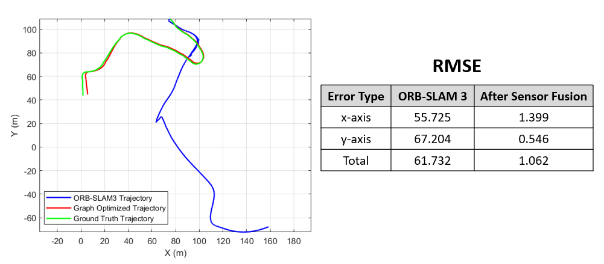

# Robot Localization on NCLT dataset using ORB-SLAM III and Graph-Based Sensor Fusion

This is the repository for WN22 NA 568 Team 20's Final Project. This project is based on the visual-inertial SLAM algorithm [ORB-SLAM 3](https://github.com/UZ-SLAMLab/ORB_SLAM3)

Project report: [https://arxiv.org/abs/](https://arxiv.org/abs/)

## Table of Contents
- [Robot Localization on NCLT dataset using ORB-SLAM III and Graph-Based Sensor Fusion](#Robot Localization on NCLT dataset using ORB-SLAM III and Graph-Based Sensor Fusion)
  - [Table of Contents](#table-of-contents)
  - [Background](#background)
    - [Overview](#overview)
    - [Results](#results)
  - [Dependencies](#dependencies)
  - [Install](#install)
  - [Dataset Preparation](#dataset-preparation)
  - [Usage](#usage)
  - [Authors](#authors)
  - [Citation](#citation)

## Background

Lorem ipsum dolor sit amet, nam erant recusabo at, velit nobis oblique no est. In pri verear explicari constituto. Reque copiosae luptatum in pri. Ne placerat hendrerit duo, ut porro malorum consectetuer vis, ad aeque tritani mea.

Ea eos dicit sonet iudicabit, ut cum omnes consetetur, cu sint erant sit. Consul prompta at eos, sea purto munere erroribus id, vide suscipit ponderum no nam. Nec ridens expetenda scribentur ut, cu probatus definitiones qui, platonem principes eu est. No iisque similique definitiones sit. Mea ne nisl delectus intellegam, vim fugit graece possim ea.

Check out the introduction video [here](https://www.youtube.com/watch?v=nWXb3qt6gEo)  

### Overview


### Results
We test the original ORB-SLAM 3 on the NCLT dataset in mono-inertial mode, and find that the result is not quite good. Then we propose the sensor fusion with wheel encoder using graph optimiaztion and compare with the original estimation.


## Dependencies
To build and run [ORB-SLAM 3](https://github.com/UZ-SLAMLab/ORB_SLAM3), you need:

- C++11 or C++0x Compiler
- CMake
- Pangolin
- OpenCV
- Eigen3
- DBoW2 and g2o (Already included in ORB-SLAM 3 folder)

For data formatting and sensor fusion, you also need Matlab to execute the script.

## Install
First, please make sure you have all the dependencies ready in your environment.

To clone this repo into your working directory 

```bash
$ git clone https://github.com/kennyzzk/Robot-Localization-on-NCLT-dataset-using-ORB-SLAM-III-and-Graph-Based-Sensor-Fusion.git
```

Then build the ORB-SLAM 3 using CMake.
```bash
$ cd Robot-Localization-on-NCLT-dataset-using-ORB-SLAM-III-and-Graph-Based-Sensor-Fusion\
> /ORB_SLAM3
$ ./build.sh
```
## Dataset Preparation
The folder `Utility` contains all the script needed. Please refer to [its Readme file](Ultility/README.md) for further detail.

## Usage

To run the ORB-SLAM 3 on the NCLT dataset, using the bash script inside the `ORB_SLAM3` folder 
```bash
$ cd ORB_SLAM3
$ ./run.sh
```
Then, to run the sensor fusion using graph optimization. You should copy the exported trajectory estimation file `f_NCLT.txt` to the folder `graph_optimization`. Also, you need to download the corresponding groundtruth file and the odometry files and put then into the same directory. Don't forget to change the input filenames to your choice of sequence.

## Authors


## Citation
```


```